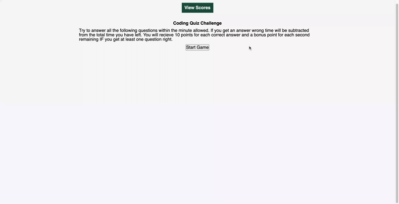

# codingquizhw4
coding quiz MSU bootcamp Homework 4
# Coding Quiz - Homework 4 
## Michigan State University Coding Bootcamp 

Project By: 
Ian Hennessey 
GitHub Profile:  <https://github.com/atleastitsanethosman> 
Project GitHub Repository: <https://github.com/atleastitsanethosman/codingquizhw4> 
Project URL: <https://atleastitsanethosman.github.io/codingquizhw4/> 

## Project Description
The goal of this project was to use Javascript to create a coding quiz that would test a user on their knowledge of Javascript, and use storage to be able to view previous users scores.  The primary technologies used are Javascript and some CSS to add styling.

## Footage of Deployed Application

## Project Elements: 

1. The webpage has an introduction page with the ability to view previous scores and a start button.

2. There is a timed quiz consisting of a series of 6 questions.

3. Feedback is given to the response to each of the questions to tell the user if their answer was correct or incorrect, if incorrect 10 seconds are removed from remaining time.

4. at the end of the quiz, either due to answering all questions, or time running out the user is given the opportunity to save their score and initials.
